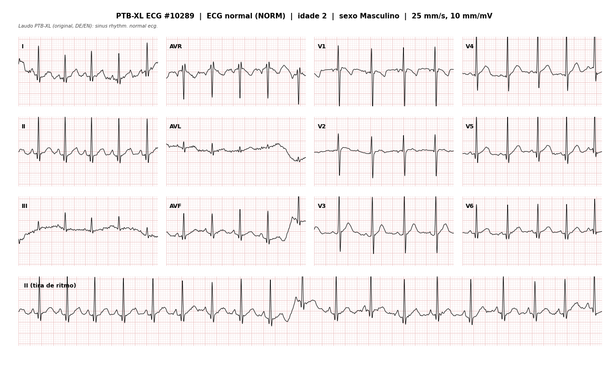
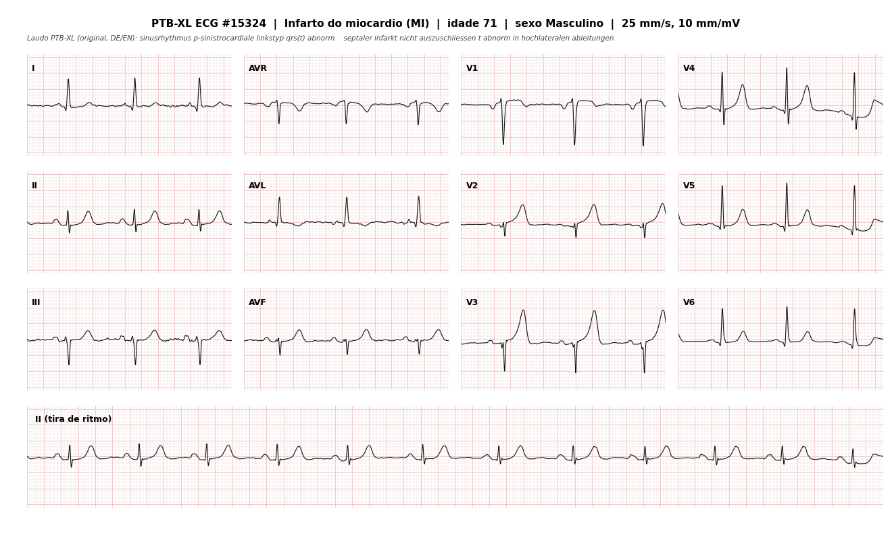

# FIAP - Faculdade de Informática e Administração Paulista

<p align="center">
<a href= "https://www.fiap.com.br/"></a>
</p>

<br>

# CardioIA — Fase 1: Batimentos de Dados
### A Busca de Dados: Preparando o Terreno para a Inteligência Cardiológica

## 👨‍🎓 Integrantes
- <a href="https://www.linkedin.com/">Guilherme Yamada Dantas — RM rm568506</a>

## 👩‍🏫 Professores
### Tutor(a)
- _(preencher com o nome do tutor da turma)_
### Coordenador(a)
- André Godoi Chiovato

---

## 📜 Descrição

O **CardioIA** é um projeto acadêmico do curso de Inteligência Artificial da FIAP que,
ao longo de 7 fases, simula o ecossistema de uma **cardiologia moderna** — triagem,
diagnóstico assistido, monitoramento contínuo, assistência remota e previsão de eventos
— integrando Machine Learning, Visão Computacional, IoT e agentes inteligentes.

Nesta **Fase 1 — Batimentos de Dados**, o papel é o de **cientista de dados
hospitalar**: antes de qualquer modelo, é preciso **levantar, organizar, documentar e
criticar** os dados que alimentarão todos os módulos seguintes. A entrega reúne as três
matérias-primas fundamentais do projeto, todas obtidas de **fontes públicas reais**:

1. **Dados numéricos (ML / IoT clínico)** — 920 pacientes cardíacos da base *UCI Heart
   Disease*, com idade, sexo, pressão arterial, colesterol, tipo de dor torácica,
   resultados de ECG de repouso, frequência cardíaca máxima e marcadores de isquemia,
   além do diagnóstico angiográfico como variável-alvo.
2. **Dados textuais (NLP)** — 4 textos (~93 mil palavras, português e inglês) sobre
   doença cardiovascular: folha informativa da **OPAS/OMS**, artigo dos **Arquivos
   Brasileiros de Cardiologia** (SciELO) e duas obras médicas históricas do **Project
   Gutenberg**.
3. **Dados visuais (Visão Computacional)** — 120 imagens de **eletrocardiograma de 12
   derivações**, renderizadas a partir de sinais reais da base **PTB-XL / PhysioNet** e
   **rotuladas por achado diagnóstico** (normal, infarto, alteração de ST/T, distúrbio
   de condução, hipertrofia).

Cada conjunto é **regenerável por um script Python versionado**, tem **licença
identificada** e vem acompanhado de documentação de proveniência, decisões de limpeza e
**análise de viés** — porque, nesta fase, governança de dados não é um apêndice: é o
critério de qualidade da base. Todos os três conjuntos superam o mínimo exigido pela
atividade e, quando possível (numérico e visual), já vêm **rotulados** para
aprendizado supervisionado nas próximas fases.

> **Origem dos dados:** todos **reais** (nenhum simulado). Detalhe de cada fonte,
> licença e citação em [`CITACOES.md`](CITACOES.md).

---

## 📁 Estrutura de pastas

```
fiap-preparando-terreno-para-inteligencia-cardiologica/
│
├── README.md                    ← este arquivo
├── CITACOES.md                  ← fontes, licenças e como citar
├── LICENSE                      ← CC BY 4.0
│
├── assets/
│   ├── logo-fiap.png
│   └── textos/                             ← PARTE 2 — corpus textual (NLP)
│       ├── 01_opas_oms_doencas_cardiovasculares_pt.txt
│       ├── 02_scielo_abc_prevalencia_doencas_cardiacas_pt.txt
│       ├── 03_gutenberg_lettsomian_lectures_diseases_heart_en.txt
│       ├── 04_gutenberg_arteriosclerosis_and_hypertension_en.txt
│       ├── FONTES_E_LICENCAS.md            ← fontes + plano de uso em NLP
│       └── preparar_textos.py              ← pipeline reprodutível (download + limpeza)
│
├── dados/
│   ├── numericos/                          ← PARTE 1 — dados clínicos tabulares (ML/IoT)
│   │   ├── cardioia_heart_disease.csv      ← DATASET FINAL (920 pacientes × 25 colunas)
│   │   ├── dicionario_de_dados.md          ← significado e relevância de cada variável
│   │   ├── analise_exploratoria.md         ← EDA automática (distribuições, ausência, viés)
│   │   ├── preparar_dados_numericos.py     ← pipeline reprodutível (bruto → limpo)
│   │   └── brutos/                         ← dados originais da UCI (4 instituições)
│   │
│   └── visuais/                            ← PARTE 3 — imagens de ECG (Visão Computacional)
│       ├── ecg_images/                     ← 120 ECGs de 12 derivações (.png)
│       ├── labels.csv                      ← rótulo diagnóstico + metadados de cada imagem
│       ├── amostras/                       ← 10 imagens (2 por classe) para visualização rápida
│       ├── LEIA-ME.md                      ← descrição + plano de uso em Visão Computacional
│       ├── scp_statements.csv              ← dicionário de códigos SCP-ECG (PTB-XL)
│       └── gerar_imagens_ecg.py            ← pipeline reprodutível (PTB-XL → imagens rotuladas)
│
├── docs/
│   ├── documento-resumo.md                 ← RESUMO EXECUTIVO da entrega
│   ├── governanca-dados-e-vies.md          ← análise completa de governança e viés
│   └── ai_project_document_fiap.md         ← documento do projeto (modelo FIAP, preenchido)
│
├── scripts/
│   ├── baixar_dados_brutos.sh              ← baixa os dados brutos (UCI + metadados PTB-XL)
│   └── empacotar_entrega.sh               ← gera os .zip do pacote público
│
├── notebooks/                              ← reservada para os notebooks de Colab/Jupyter das próximas fases
└── src/                                    ← reservada para o código-fonte das próximas fases
```

---

## 🩺 Parte 1 — Dados Numéricos (ML / IoT)

**Arquivo:** `dados/numericos/cardioia_heart_disease.csv` · **920 linhas × 25 colunas** ·
mínimo exigido: 100 linhas.

### Origem — dados **reais**

Base **UCI Heart Disease** (Janosi, Steinbrunn, Pfisterer & Detrano, 1988), união das
**4 instituições** que a compõem: Cleveland Clinic Foundation (EUA), Hungarian
Institute of Cardiology (Budapeste), University Hospitals de Zurique e Basileia (Suíça)
e V.A. Medical Center de Long Beach (EUA). Licença **CC BY 4.0**. É o dataset de
referência da literatura para predição de doença arterial coronariana.

O script [`preparar_dados_numericos.py`](dados/numericos/preparar_dados_numericos.py)
une as 4 bases, corrige tipos, converte "zeros clínicos impossíveis" (colesterol ou
pressão iguais a 0) em valor ausente, adiciona colunas legíveis em português e as duas
variáveis-alvo, e gera a análise exploratória.

### Variáveis mais relevantes do ponto de vista clínico (e por que importam para IA)

| Variável | Por que é clinicamente relevante | Por que importa para o modelo |
|---|---|---|
| `age` | Risco cardiovascular cresce de forma quase monotônica com a idade | Preditor de base; define o risco pré-teste |
| `sex` | Homens têm evento coronariano ~10 anos mais cedo; apresentação feminina é atípica e subdiagnosticada | Variável de **equidade** — exige avaliar recall por sexo |
| `cp` / `tipo_dor_peito` | Angina **típica** eleva muito a probabilidade de doença; "assintomático" a reduz | Sintoma central da triagem; provável *feature* de maior peso |
| `trestbps` (PA sistólica) | Hipertensão é fator de risco **maior e modificável** | Alvo de recomendação preventiva, não só de diagnóstico |
| `chol` (colesterol) | Dislipidemia é causa direta de aterosclerose | Fator de risco modificável; muita ausência → decisão de tratamento |
| `thalach` (FC máxima) | Incompetência cronotrópica associa-se a pior prognóstico | Marcador funcional de isquemia |
| `exang` (angina de esforço) | Forte indício de isquemia induzível | *Feature* de alta especificidade |
| `oldpeak` / `slope` | Desnível de ST no esforço é o achado clássico de isquemia | Variável contínua informativa para o alvo |
| `ca` (vasos na fluoroscopia) | Proxy **direto** da carga aterosclerótica | Muito preditiva, mas **66% ausente** — risco de viés |
| `restecg` / `ecg_repouso` | Liga a Parte 1 (tabular) à Parte 3 (imagens de ECG) | Permite modelos multimodais nas próximas fases |

**Variáveis-alvo:** `doenca_cardiaca` (binária, `0/1`) e `diagnostico_num` (0–4, nº de
vasos obstruídos) para tarefas multiclasse/ordinais.

### Já documentado (ver [EDA](dados/numericos/analise_exploratoria.md))
- 55,3% dos pacientes têm doença cardíaca (base relativamente balanceada no alvo).
- **Viés de sexo:** 78,9% são homens.
- **Viés de seleção:** base da Suíça com 93,5% de doentes (hospital terciário).
- **Ausência não aleatória:** `ca` 66%, `thal` 53%, `slope` 34% — dependente da instituição.

---

## 📚 Parte 2 — Dados Textuais (NLP)

**Pasta:** `assets/textos/` · **4 arquivos `.txt`**, ~93 mil palavras · mínimo exigido: 2.

| # | Texto | Idioma | Fonte | Licença |
|---|---|---|---|---|
| 01 | *Doenças cardiovasculares* — folha informativa | PT | OPAS/OMS | Conteúdo público (atribuição) |
| 02 | *Prevalência das Doenças Cardíacas em 60 anos dos Arq. Bras. de Cardiologia* | PT | SciELO / ABC 2014 | CC BY-NC 3.0 |
| 03 | *Lettsomian Lectures on Diseases of the Heart and Arteries* (1901) | EN | Project Gutenberg #43780 | Domínio público |
| 04 | *Arteriosclerosis and Hypertension* (1912) | EN | Project Gutenberg #37675 | Domínio público |

Cada `.txt` tem um cabeçalho `METADADOS` delimitado e o corpo já normalizado para texto
puro UTF-8. Gerados por [`preparar_textos.py`](assets/textos/preparar_textos.py).

### Como esses textos podem ser explorados por algoritmos de NLP — e por que é relevante

| Análise de NLP | O que se extrai deste corpus | Relevância para IA em saúde |
|---|---|---|
| **Extração de sintomas / NER clínico** | "dor no centro do peito", "dor no braço/mandíbula", "falta de ar", "suor frio", "palpitação", "síncope" (textos 01 e 03) | Transforma queixa em linguagem natural em variáveis estruturadas → alimenta a **triagem digital** (Fase 2) |
| **Classificação de tópicos / especialidade** | O texto 02 já organiza a cardiologia em grupos (coronariopatia, valvopatia, arritmia, insuficiência cardíaca, fatores de risco) — rótulos prontos | Roteamento automático de mensagens de pacientes e de documentos |
| **Análise de sentimento / legibilidade** | Contraste entre o tom preventivo da OPAS e o tom prognóstico das obras históricas | Calibra o **assistente virtual empático** (Fase 5) para comunicar risco sem alarmar |
| **Normalização terminológica** | Termos de 1901/1912 ("tobacco heart", "soldier's heart") × terminologia atual | Mapeamento para CID-10 / DeCS / SNOMED — base de qualquer NLP clínico sério |
| **Recuperação de informação (RAG)** | Corpus pequeno e curado como base de conhecimento | Chatbot com citação de fonte (Fase 5) |

**Por que importa:** a maior parte da informação clínica real é **texto livre**
(evoluções, laudos, anamnese). Sem NLP, essa informação não chega aos modelos — e a
triagem depende exatamente de converter texto em dado estruturado. Detalhes e plano
completo em [`FONTES_E_LICENCAS.md`](assets/textos/FONTES_E_LICENCAS.md).

---

## 🖼️ Parte 3 — Dados Visuais (Visão Computacional)

**Pasta:** `dados/visuais/ecg_images/` · **120 imagens `.png`** · mínimo exigido: 100.

### Origem — sinais **reais**, renderizados no formato clínico

Imagens de **ECG de 12 derivações** geradas a partir de sinais reais da base
**PTB-XL** (21.799 registros de 18.869 pacientes, PhysioNet, licença **CC BY 4.0**). Cada imagem é um ECG
de 10 segundos de um paciente real, plotado no padrão que o cardiologista lê
(25 mm/s, 10 mm/mV, grade "papel de ECG"). Gerador:
[`gerar_imagens_ecg.py`](dados/visuais/gerar_imagens_ecg.py).

### Rotulado e balanceado — [`labels.csv`](dados/visuais/labels.csv)

| Classe | Código | Imagens | Achado |
|---|---|---|---|
| ECG normal | `NORM` | 24 | Sem anormalidade diagnóstica |
| Infarto do miocárdio | `MI` | 24 | Ondas Q patológicas |
| Alteração de ST/T | `STTC` | 24 | Isquemia / sobrecarga |
| Distúrbio de condução | `CD` | 24 | Bloqueios de ramo/fascículo, WPW |
| Hipertrofia | `HYP` | 24 | Sobrecarga de câmaras |

Balanceamento: **60 masculino / 60 feminino**, idades de 2 a 89 anos. Apenas registros
com **laudo validado por cardiologista** e **uma superclasse dominante**.

### Como essas imagens poderão ser analisadas por Visão Computacional — e por que é relevante

| Técnica de VC | Aplicação | Relevância para IA em saúde |
|---|---|---|
| **Detecção de bordas / segmentação** (Canny, Sobel, limiarização) | Separar o traçado da grade; isolar cada derivação | Digitalizar ECGs em **papel** — ainda arquivados em boa parte do SUS |
| **Detecção de padrões / picos** | Localizar complexos QRS, medir RR, estimar FC e ritmo | Alimenta monitoramento (Fase 3) e previsão de crises (Fase 6) |
| **Classificação supervisionada (CNN)** | `imagem → {NORM, MI, STTC, CD, HYP}` usando `labels.csv` | Núcleo do **diagnóstico assistido por imagem** (Fase 4) |
| **Reconhecimento de anomalias** | Sinalizar supradesnível de ST (candidato a IAM), QRS alargado | Triagem automática e priorização de fila |
| **Grad-CAM / mapas de saliência** | Mostrar em qual derivação o modelo "olhou" | **Explicabilidade** — exigência ética para apoio à decisão |
| **Aumento de dados** | Ruído, deriva de linha de base, rotação leve | Robustez a aparelhos e condições reais de captura |

**Por que ECG:** é o exame cardiológico **mais disponível, barato e padronizado** — e
nem toda unidade tem cardiologista de plantão para interpretá-lo. Um classificador
confiável funciona como **segunda opinião** e como **ordenador de fila**. Erros têm
custo assimétrico (não ver um infarto é muito pior que um falso alarme), e ter rótulos
por classe desde já permite otimizar sensibilidade. Detalhes em
[`LEIA-ME.md`](dados/visuais/LEIA-ME.md).

### Amostras

<p align="center">


</p>
<p align="center"><em>Esquerda: ECG normal (NORM). Direita: infarto do miocárdio (MI). Mais amostras em <code>dados/visuais/amostras/</code>.</em></p>

---

## 🔗 Links públicos para o conjunto completo de dados

O conjunto completo (numérico + textual + visual) está **versionado neste repositório**
e também empacotado para download direto, **acessível a qualquer pessoa sem login**:

| Pacote | Conteúdo | Link |
|---|---|---|
| `cardioia-fase1-dados-completo.zip` | Tudo (numérico + textual + visual + docs) | [⬇️ download](https://github.com/japatraderdev99/fiap-preparando-terreno-para-inteligencia-cardiologica/releases/download/v1.0-fase1/cardioia-fase1-dados-completo.zip) |
| `cardioia-fase1-dados-numericos.zip` | Parte 1 — UCI Heart Disease + dicionário + EDA | [⬇️ download](https://github.com/japatraderdev99/fiap-preparando-terreno-para-inteligencia-cardiologica/releases/download/v1.0-fase1/cardioia-fase1-dados-numericos.zip) |
| `cardioia-fase1-dados-textuais.zip` | Parte 2 — 4 textos + fontes/licenças | [⬇️ download](https://github.com/japatraderdev99/fiap-preparando-terreno-para-inteligencia-cardiologica/releases/download/v1.0-fase1/cardioia-fase1-dados-textuais.zip) |
| `cardioia-fase1-dados-visuais.zip` | Parte 3 — 120 ECGs + `labels.csv` | [⬇️ download](https://github.com/japatraderdev99/fiap-preparando-terreno-para-inteligencia-cardiologica/releases/download/v1.0-fase1/cardioia-fase1-dados-visuais.zip) |

**Página do release (armazenamento público, permanente, sem login):**
<https://github.com/japatraderdev99/fiap-preparando-terreno-para-inteligencia-cardiologica/releases/tag/v1.0-fase1>

Os quatro `.zip` acima também estão espelhados em uma pasta do Google Drive
("FIAP - CardioIA - Fase 1"), como redundância. Qualquer um dos links atende à correção.

---

## 🔧 Como executar

**Pré-requisitos:** Python 3.10+ e as bibliotecas:

```bash
pip install pandas numpy matplotlib scipy wfdb
```

**Regenerar cada conjunto de dados (opcional — os dados já estão no repositório):**

```bash
# Parte 1 — dataset numérico (rápido; usa os dados brutos em dados/numericos/brutos/)
python dados/numericos/preparar_dados_numericos.py

# Parte 2 — corpus textual (baixa das fontes públicas)
python assets/textos/preparar_textos.py

# Parte 3 — 120 imagens de ECG (baixa sinais da PTB-XL; ~5 min)
python dados/visuais/gerar_imagens_ecg.py --por-classe 24
```

**Carregar os dados em um notebook (Colab/Jupyter):**

```python
import pandas as pd
df = pd.read_csv("dados/numericos/cardioia_heart_disease.csv")
labels = pd.read_csv("dados/visuais/labels.csv")
texto = open("assets/textos/01_opas_oms_doencas_cardiovasculares_pt.txt", encoding="utf-8").read()
```

---

## 🗃 Histórico de lançamentos

* **1.0.0 — 02/09/2026**
    * Fase 1 completa: dataset numérico (920 pacientes), corpus textual (4 textos) e
      conjunto visual (120 ECGs rotulados).
    * Pipelines reprodutíveis para os três conjuntos.
    * Documento-resumo, análise de governança e viés, documento do projeto (modelo FIAP).

---

## 📋 Licença


Este repositório é distribuído sob **[Creative Commons Attribution 4.0 International (CC BY 4.0)](LICENSE)**,
compatível com as licenças das bases de dados utilizadas. As fontes originais e suas
licenças específicas estão em [`CITACOES.md`](CITACOES.md).
